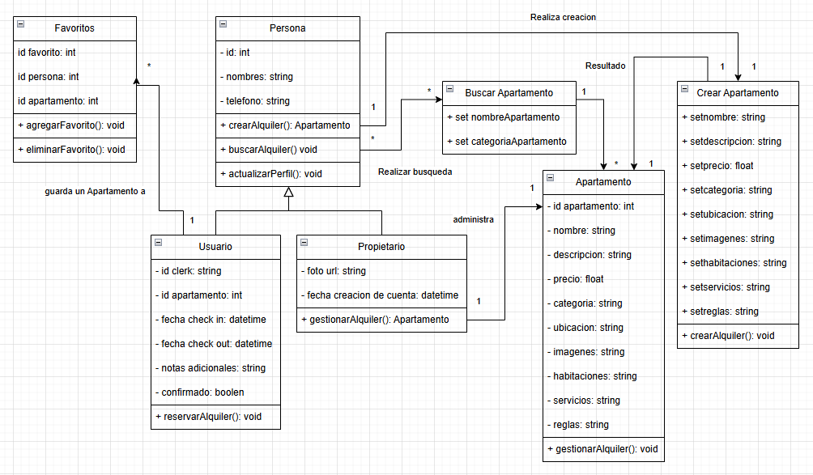
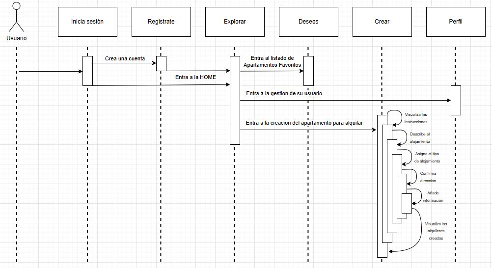
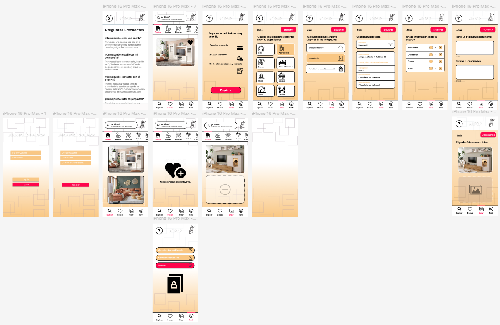
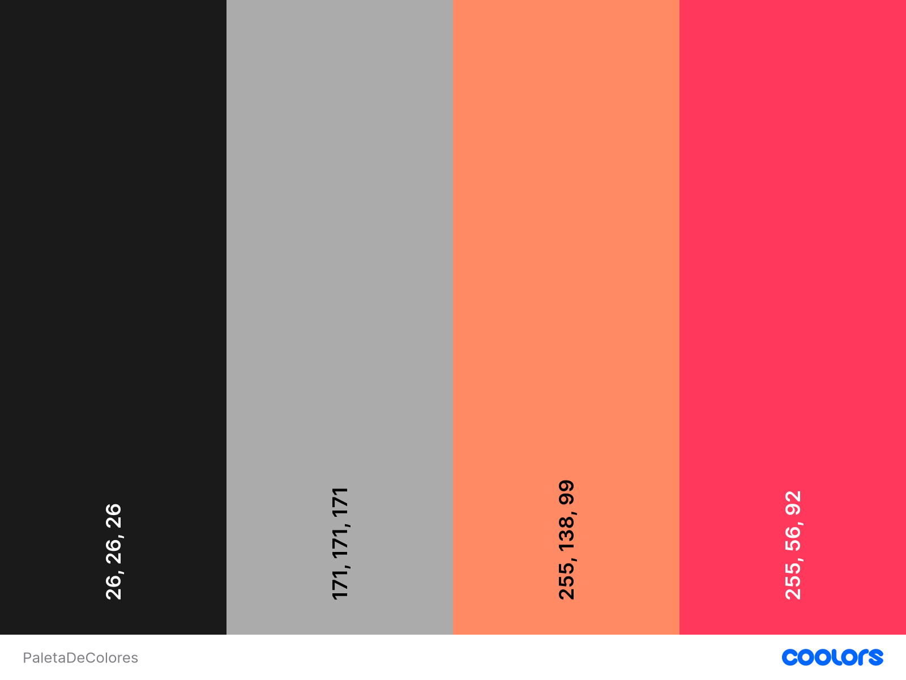

# Proyecto AirP&P
## Explicacion idea del proyecto
...
## Nuestros Objetivos
...
## Tecnologias Usadas
...
## Diagramas
### Diagrama de Clases

### Diagrama de Secuencia

### Diagrama de Casos de Uso

## Pagina Web
### Mockup

### Paleta De Colores

### Logo

### Funcionalidades Web
...
## Roadmap/Trello/Gantt
