# Proyecto AlquilaTuEvento
## Explicacion idea del proyecto
La app propuesta es la creación de una app que conecte a los usuarios con todos los
locales de eventos (casas, salas de recepciones, bares, auditorios para eventos corporativos, campos
de esparcimiento, canchas de fútbol, y todo local que brinde algún ambiente de esparcimiento o para la realización de eventos importantes) y les permita realizar reservas en línea.

La app va permitir a los usuarios visualizar la disponibilidad de los locales en las fechas y horarios
que requieran, visualizar el ambiente, coordinar visitas si el cliente desea, reservar y pagar en línea.

A los dueños de los locales les permitirá ofrecer a más personas sus servicios, conectándonos con más clientes potenciales.

## Nuestros Objetivos
Ser la manera más fácil de reservar y alquilar locales para eventos en Latinoamerica.
## Tecnologias Usadas
- React
- js
- typescript
- sql

## Componentes
- Clerk
- Expo Go
- Ngrok
- Email JS

## Diagramas
### Diagrama de Clases
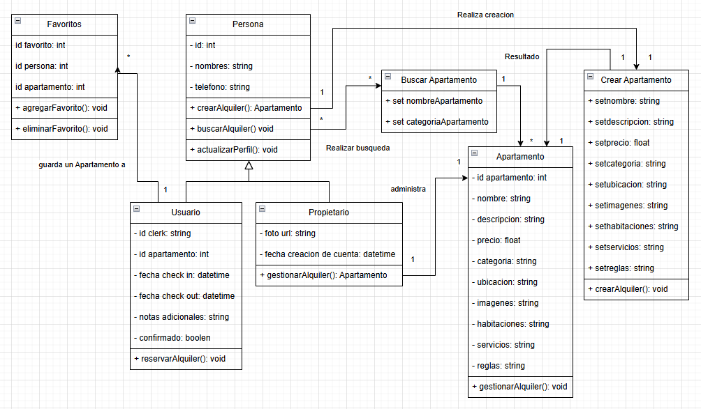
### Diagrama de Secuencia
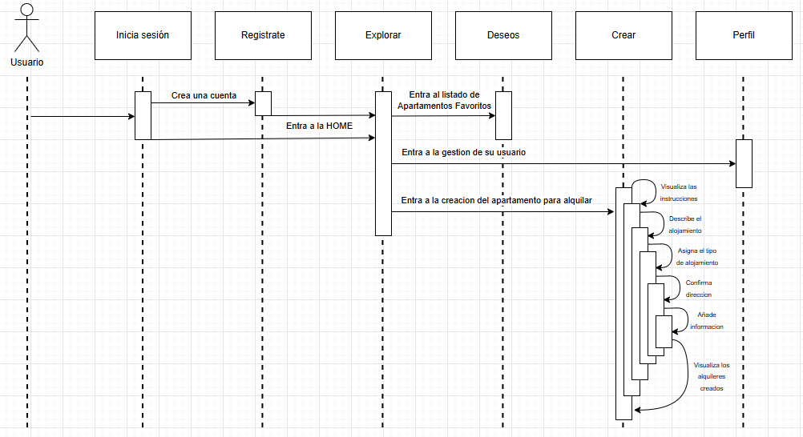
### Diagrama de Casos de Uso
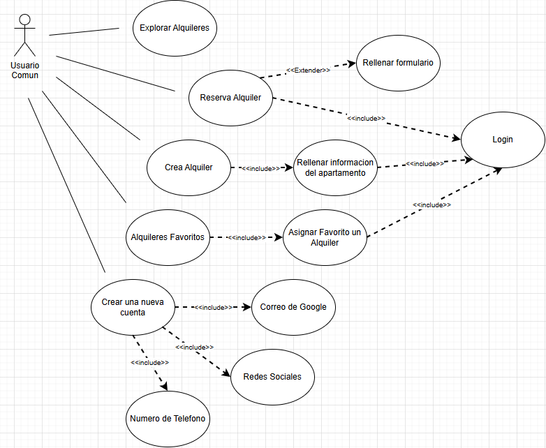
## Pagina Web
### Mockup
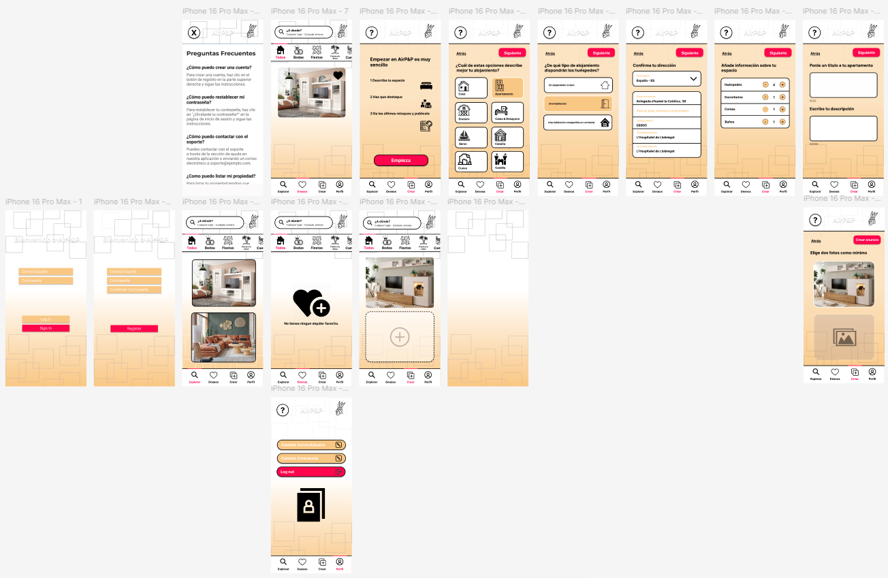
### Paleta De Colores
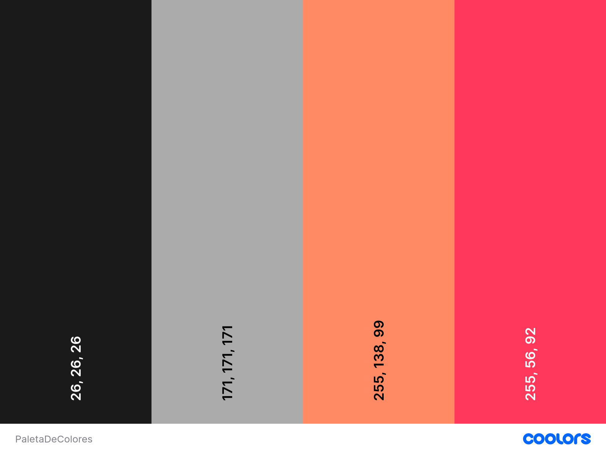
### Logo

## Requisitos para que la aplicación funcione

Primero desde el móvil ir a https://expo.dev/go y seleccionar el SDK la versión “SDK 51” Y “Android” y lo descargamos.

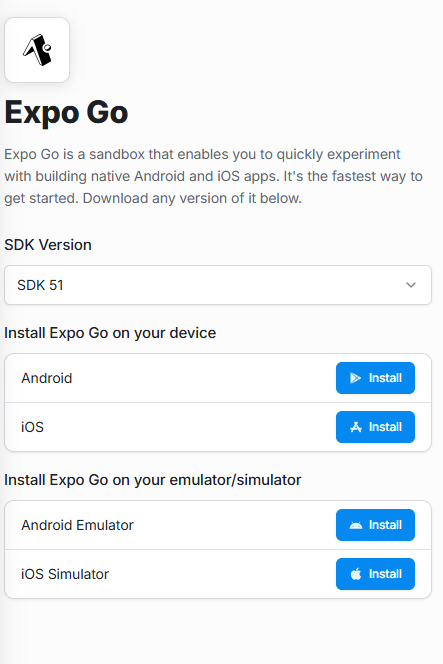

Ahora en el pc debemos tener encendido el xampp.

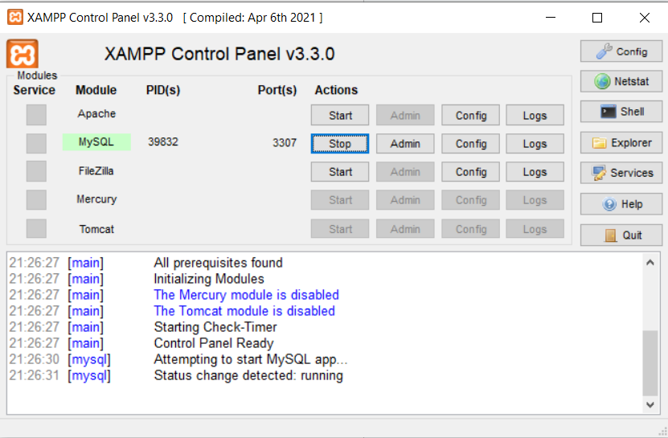

abrir el .sql del proyecto, abrirlo en MySQLWorkbench y ejecutar todo el código para crear la base de datos.

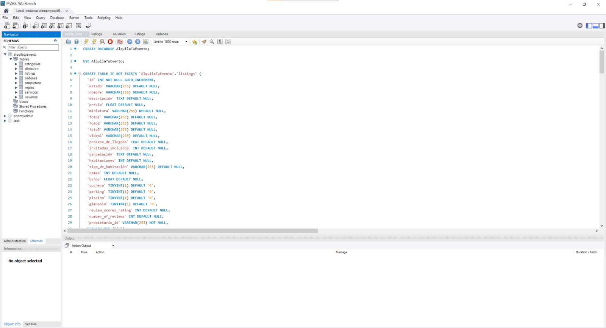

ahora en el proyecto pones la dirección ip actual (que sea del internet importante porque debe ser el mismo que use el celular) en el .env en el parámetro “EXPO_PUBLIC_API_IP”

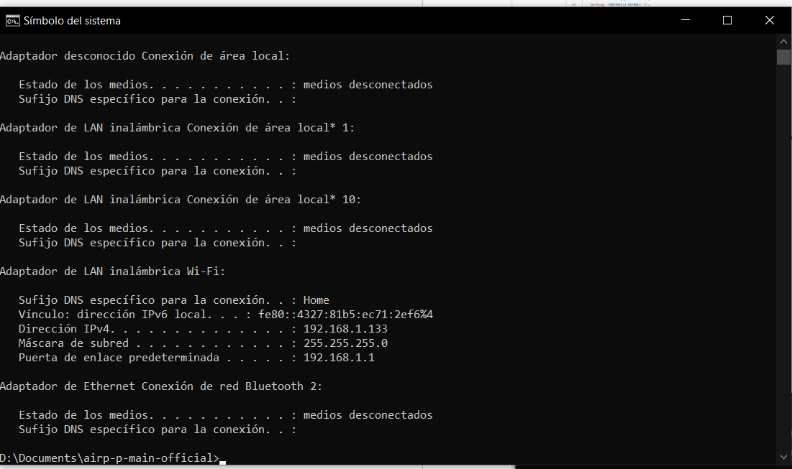
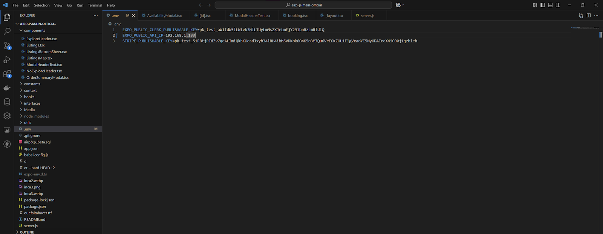

Ahora hay que abrir una terminal con la dirección del proyecto y ejecutar:

El comando “node server.js” para ejecutar nuestro servidor de nodejs.

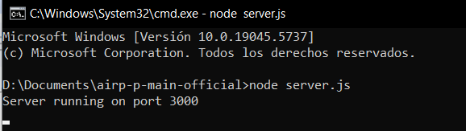

y en otra terminal con al dirección del proyecto ejecutar “npm install” para descargar todas las dependencias de proyecto:

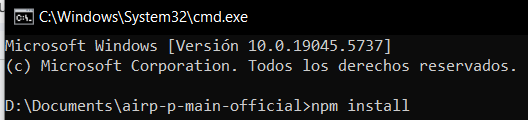

y después npm start para ejecutar el proyecto

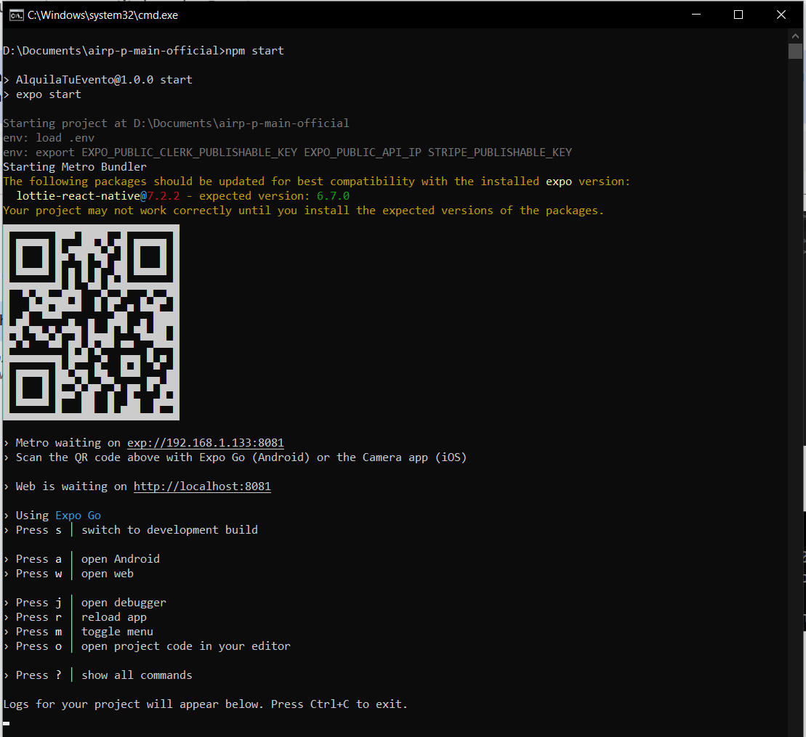

esto nos dará un QR que tenemos que escanear con la aplicación “Expo go” que descargamos antes.

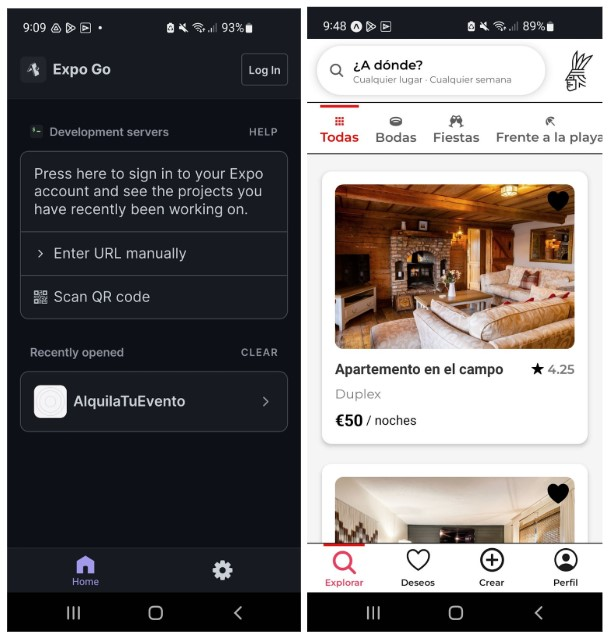

Y nos aparecerá la aplicación!

Por último para que funcione el sistema de usuarios de clerk teneis que crear una cuenta en clerk.com 

y poner el api key que os aparecerá en el apartado “Configure/Api keys”

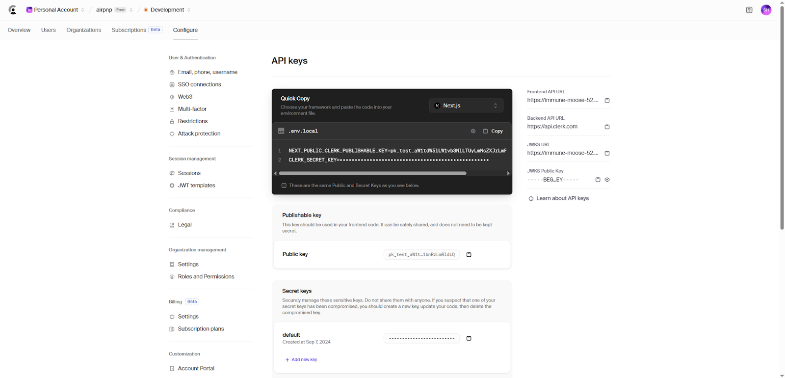

en el archivo .env en el parámetro “EXPO_PUBLIC_CLERK_PUBLISHABLE_KEY”  sustituyendo el que funcionaba para mi cuenta de clerk a la vuestra.

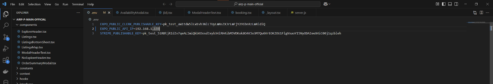

Una vez hecho esto, tendréis que descargar ngrok

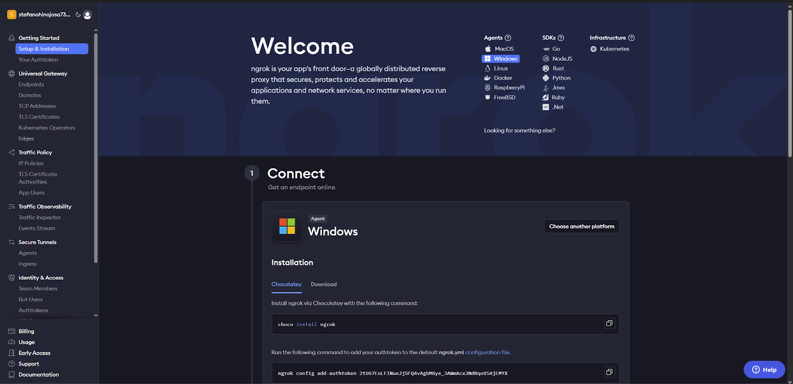

y una vez descargado ejecutar el ngrok.exe como dice la misma guia tienes que ejecutar “ngrok config add-authtoken (tucodigo)” y “ngrok http http://localhost:3000” con esto expondremos a internet nuestro servidor de nodejs que trabaja en el puerto 3000 y así ahora podremos conectarlo con al webhook de clerk.

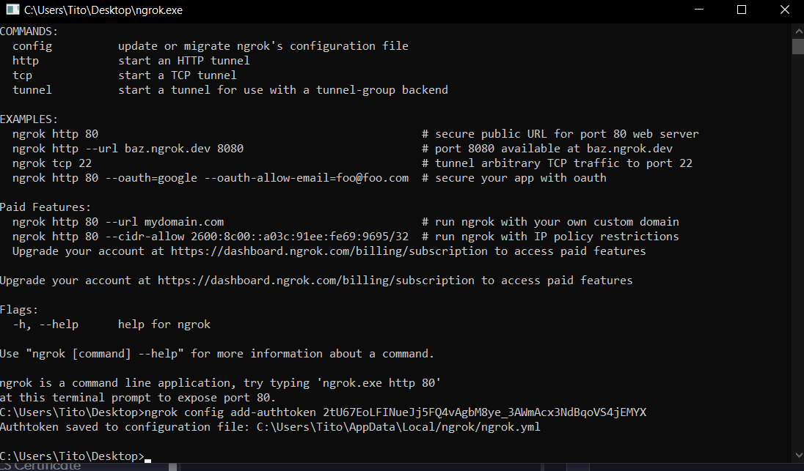

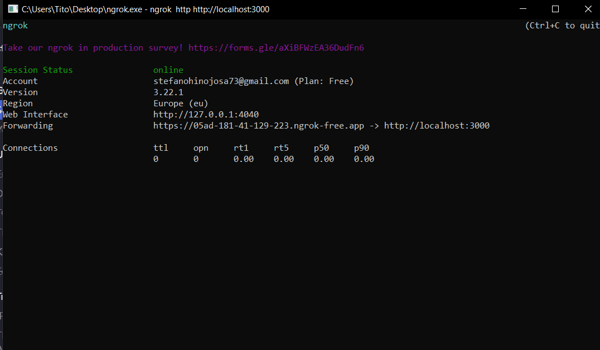

Nos vamos en clerk.com a la sección de Configure/webhooks 

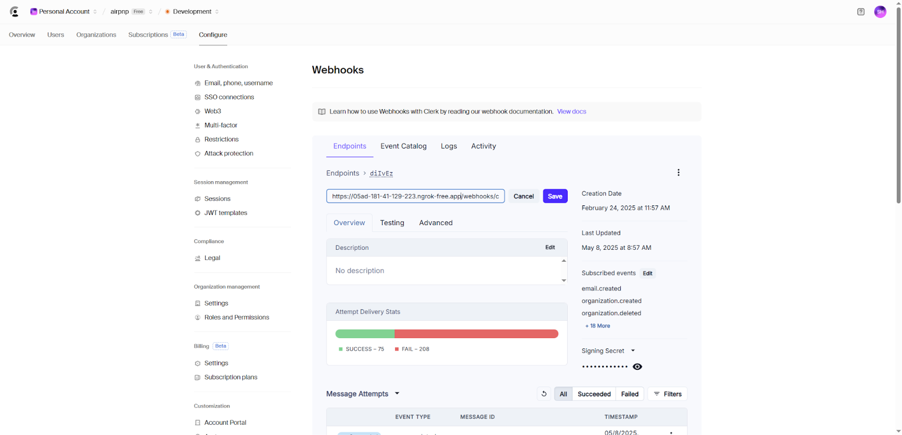

le añadimos un endpoint y ponemos la dirección dada por ngrok y salvamos.

Ahora estará completamente conectado y cada vez que un usuario se loguee o registre lo veremos reflejado en la sección de “users” de clerk.

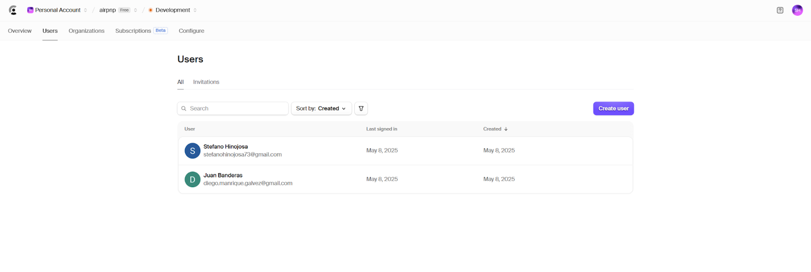

Y con esto tendríamos la aplicación completamente funcional como en la presentación.
