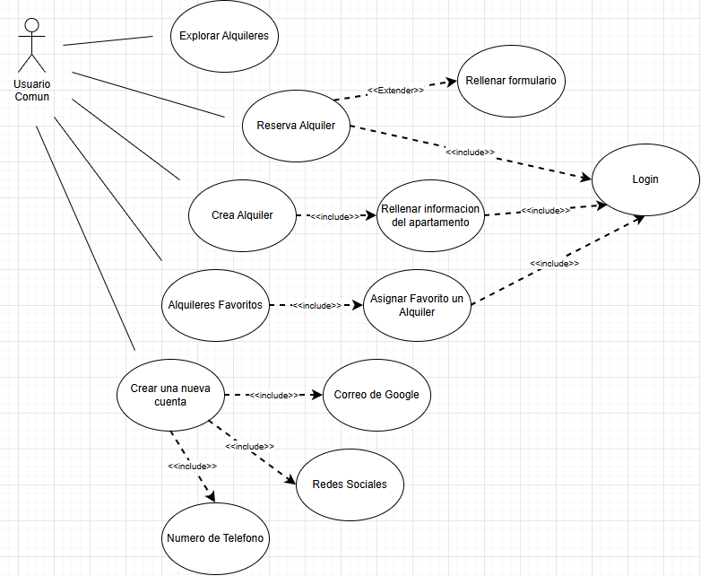

# Proyecto AirP&P
## Explicacion idea del proyecto
La app propuesta es la creación de una app que conecte a los usuarios con todos los
locales de eventos (casas, salas de recepciones, bares, auditorios para eventos corporativos, campos
de esparcimiento, canchas de fútbol, y todo local que brinde algún ambiente de esparcimiento o para la realización de eventos importantes) y les permita realizar reservas en línea.

La app va permitir a los usuarios visualizar la disponibilidad de los locales en las fechas y horarios
que requieran, visualizar el ambiente, coordinar visitas si el cliente desea, reservar y pagar en línea.

A los dueños de los locales les permitirá ofrecer a más personas sus servicios, conectándonos con más clientes potenciales.

## Nuestros Objetivos
Ser la manera más fácil de reservar y alquilar locales para eventos en Latinoamerica.
## Tecnologias Usadas

## Diagramas
### Diagrama de Clases

### Diagrama de Secuencia

### Diagrama de Casos de Uso

## Pagina Web
### Mockup

### Paleta De Colores

### Logo

### Funcionalidades Web
...
## Roadmap/Trello/Gantt
